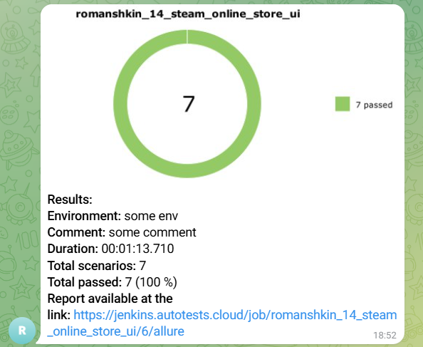
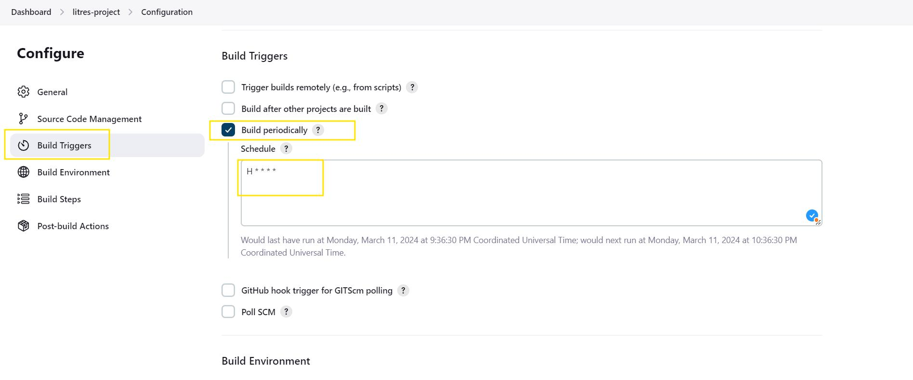

# Проект по автоматизации тестирования Steam


## Стек технологий 
<table width="100%" border='0'>
  <tbody>
    <tr>
      <td>Язык программирования, IDE</td>
      <td align="center">
        <a target="_blank" href="https://www.python.org/">
          
        </a>
        <a target="_blank" href=https://www.jetbrains.com/pycharm/>
          
        </a>
      </td>
    </tr>
    <tr>
      <td>Библиотеки, фреймворки для написания тестов</td>
      <td align="center">
        <a target="_blank" href=https://www.selenium.dev/>
          
        </a>
        <a target="_blank" href=https://github.com/yashaka/selene>
          
        </a>
        <a target="_blank" href=https://docs.pytest.org/en/stable/index.html#>
          
        </a>
      </td>
    </tr>
    <tr>
      <td>
        Запуск тестов
      </td>
      <td align="center">
        <a target="_blank" href=https://www.jenkins.io/>
          
        </a>
        <a target="_blank" href=https://github.com/aerokube/selenoid>
          
        </a>
      </td>
    </tr>
    <tr>
      <td>
        Формирование отчета и отправление уведомлений
      </td>
      <td>
        <a target="_blank" href=https://qameta.io/>
          
        </a>
        <a target="_blank" href=https://allurereport.org/>
          
        </a>
        <a target="_blank" href=https://telegram.org/>
          
        </a>
      </td>
    </tr>
  </tbody>
</table>

___
<a id="item-4"></a>

В данном проекте автотесты написаны на <code>Python</code> с использованием <code>Selenium</code>, <code>Selene</code> и <code>Pytest</code> для UI-тестов
>
> <code>Selenoid</code> выполняет запуск браузеров в контейнерах <code>Docker</code>.
>
> <code>Allure Report</code> формирует отчет о запуске тестов.
>
> <code>Jenkins</code> выполняет запуск тестов.
> После завершения прогона отправляются уведомления с помощью бота в <code>Telegram</code>.

## Список реализуемых проверок:
- Проверка добавления товара в корзину
- Проверка очищения корзины
- Проверка на смену языка сайта
- Проверка отображения товара в выпадающем списке при его поиске
- Проверка поиска товара
- Проверка появления ошибки при поиске некорректного товара
- Проверка появления ошибки при авторизации с ошибочными данными
## Запуск автотестов реализуется с помощью [jenkins](https://www.jenkins.io/) 

## Для запуска проекта удаленно с использованием **Jenkins** и **Selenoid** необходимо:
- Создать новый проект в **Jenkins**
- Указать в **Confugure** проекта:
  - В разделе **Source Code Management** в пункте **Git** директорию текущего проекта и ветку `main`
  - В **Build Steps**:
    * Создать файл `.env` по примеру `.env.example`, указав для него опции **Create at Workspace**  и **Overwrite file**
    * Создать **Execute shell** с кодом:
      ```shell
      python -m venv .venv
      source .venv/bin/activate
      pip install poetry
      poetry install
      env_context='selenoid' pytest
      ```
      - В **Post-build Actions** добавить опцию **Allure Report** с указанием пути `allure-results`
    * Добавление оповещений в **Telegram** может быть добавлено
    дополнительно
1. Открыть [задачу в Jenkins](https://jenkins.autotests.cloud/job/romanshkin_14_steam_online_store_ui/)


2. Нажать "**Build Now**".
## Allure отчёт
>Allure формирует подробный отчет о прогоне тестов. Видим общую статистику и результат каждого теста
>

>
>В отчете пишется каждый шаг теста, тесты формируются по категориям, в конце приложен скриншот, логи, page-source и видео-запись прогона теста
>


## Отчет в Telegram с помощью бота
>
> После прогона всех тестов в <code>Telegram</code> чат автоматически приходит сообщение с полной информацией о прогоне и ссылкой на <code>Allure</code>
>


## Видео прохождения тестов на selenoid
> <code>Selenoid</code> пишет видео прогона каждого теста и видео прикладывается в отчет <code>Allure</code>
>

## Добавляем таймер для запуска тестов 
Для добавления таймера для запуска тестов в блоке Build Triggers ставим отметку Build periodically. В поле Schedule вводим время запуска тестов. Для этого можно использовать следующие команды:
>
Запускать тесты каждый день в 12:00:
>
>H 12 * * *
>
Запускать тесты каждый понедельник в 12:00:
>
>H 12 * * 1
>
Запускать тесты каждый час:
>
>H * * * *
>



