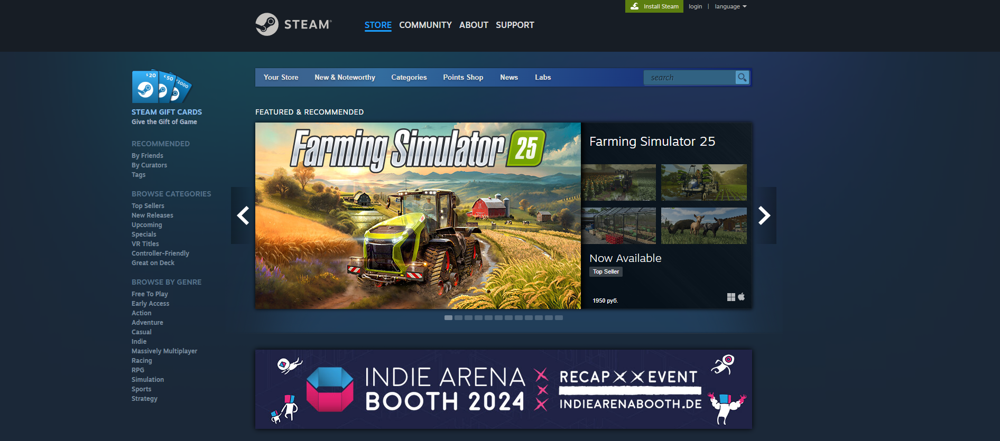
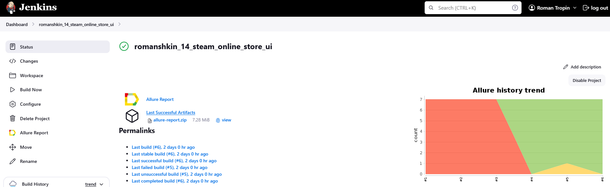
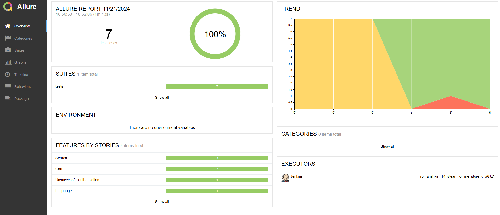
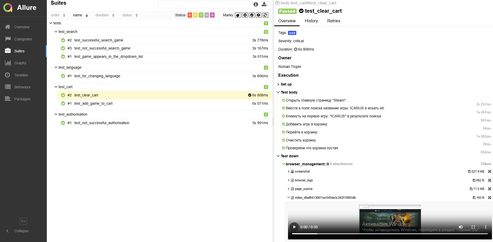
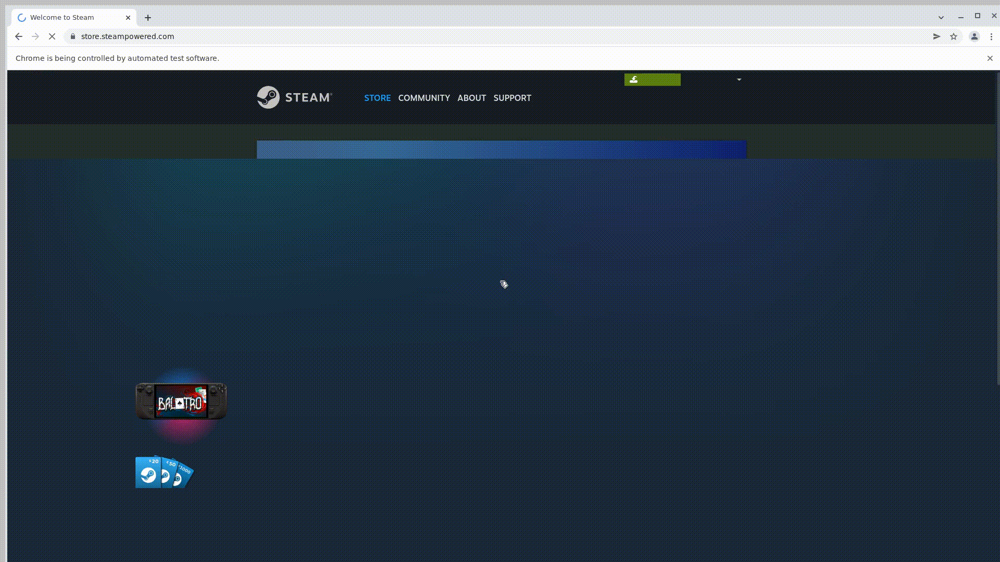

# Проект по автоматизации тестирования Steam

## Стек технологий 

В данном проекте автотесты написаны на <code>Python</code> с использованием <code>Selenium</code>, <code>Selene</code> и <code>Pytest</code> для UI-тестов
>
> <code>Selenoid</code> выполняет запуск браузеров в контейнерах <code>Docker</code>.
>
> <code>Allure Report</code> формирует отчет о запуске тестов.
>
> <code>Jenkins</code> выполняет запуск тестов.
> После завершения прогона отправляются уведомления с помощью бота в <code>Telegram</code>.

## Список реализуемых проверок:
- Проверка добавления товара в корзину
- Проверка очищения корзины
- Проверка на смену языка сайта
- Проверка отображения товара в выпадающем списке при его поиске
- Проверка поиска товара
- Проверка появления ошибки при поиске некорректного товара
- Проверка появления ошибки при авторизации с ошибочными данными
## Запуск автотестов реализуется с помощью [jenkins](https://www.jenkins.io/) 

### Для запуска автотестов в Jenkins
1. Открыть [задачу в Jenkins](https://jenkins.autotests.cloud/job/romanshkin_14_steam_online_store_ui/)

2. Нажать "**Build Now**".
## Allure отчёт
>Allure формирует подробный отчет о прогоне тестов. Видим общую статистику и результат каждого теста
>

>
>В отчете пишется каждый шаг теста, тесты формируются по категориям, в конце приложен скриншот, логи, page-source и видео-запись прогона теста
>

### Отчёт в telegram c помощью бота

### Видео прохождения тестов на selenoid
> <code>Selenoid</code> пишет видео прогона каждого теста и видео прикладывается в отчет <code>Allure</code>
>

