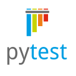

# Проект по автоматизации тестирования Steam

## Стек технологий 

В данном проекте автотесты написаны на <code>Python</code> с использованием <code>Selenium</code>, <code>Selene</code> и <code>Pytest</code> для UI-тестов
>
> <code>Selenoid</code> выполняет запуск браузеров в контейнерах <code>Docker</code>.
>
> <code>Allure Report</code> формирует отчет о запуске тестов.
>
> <code>Jenkins</code> выполняет запуск тестов.
> После завершения прогона отправляются уведомления с помощью бота в <code>Telegram</code>.

## Список реализуемых проверок:
- Проверка добавления товара в корзину
- Проверка очищения корзины
- Проверка на смену языка сайта
- Проверка отображения товара в выпадающем списке при его поиске
- Проверка поиска товара
- Проверка появления ошибки при поиске некорректного товара
- Проверка появления ошибки при авторизации с ошибочными данными
